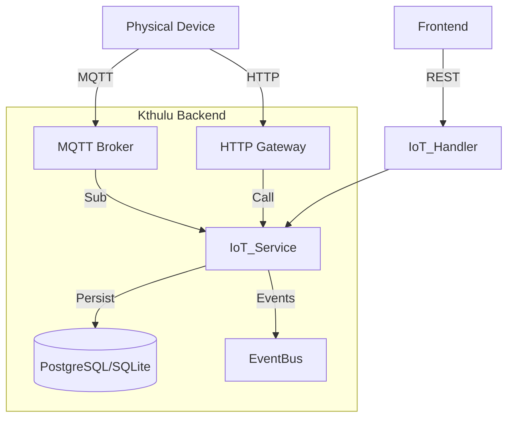

# IoT Module Design

## 1. Architecture

The IoT capability will be implemented as a modular extension `backend/backend/internal/modules/iot` following the Clean Architecture principles used in Kthulu.



## 2. Domain Model

### 2.1 Device
Represents a physical or logical entity connected to the system.

```go
type Device struct {
    ID             uint           `json:"id" gorm:"primaryKey"`
    Name           string         `json:"name" gorm:"not null"`
    Identifier     string         `json:"identifier" gorm:"uniqueIndex;not null"` // e.g., MAC address, Serial
    Type           string         `json:"type"` // e.g., "sensor", "gateway"
    AuthToken      string         `json:"-"` // Hashed token for device auth
    Status         string         `json:"status"` // "online", "offline"
    LastSeenAt     *time.Time     `json:"lastSeenAt"`
    Metadata       JSON           `json:"metadata"` // Flexible attributes
    CreatedAt      time.Time      `json:"createdAt"`
}
```

### 2.2 Telemetry
Time-series data points sent by devices.

```go
type Telemetry struct {
    ID        uint      `json:"id" gorm:"primaryKey"`
    DeviceID  uint      `json:"deviceId" gorm:"index;not null"`
    Timestamp time.Time `json:"timestamp" gorm:"index;not null"`
    Key       string    `json:"key"` // e.g., "temperature"
    Value     float64   `json:"value"` // Simplified for numeric data
    RawData   JSON      `json:"rawData"` // Full JSON payload if needed
}
```

### 2.3 Command
Instructions sent to devices.

```go
type Command struct {
    ID          uint      `json:"id" gorm:"primaryKey"`
    DeviceID    uint      `json:"deviceId" gorm:"index;not null"`
    CommandType string    `json:"commandType"` // e.g., "reboot"
    Payload     JSON      `json:"payload"`
    Status      string    `json:"status"` // "pending", "sent", "delivered", "failed"
    SentAt      *time.Time
    ExecutedAt  *time.Time
}
```

## 3. Interfaces & Components

### 3.1 HTTP Adapters (`internal/modules/iot/adapters/http`)
- `POST /api/v1/devices` - Register device
- `GET /api/v1/devices` - List devices
- `GET /api/v1/devices/{id}/telemetry` - Get history
- `POST /api/v1/devices/{id}/commands` - Send command
- `POST /api/v1/telemetry` - Ingest via HTTP (for non-MQTT devices)

### 3.2 MQTT Adapter (`internal/modules/iot/adapters/mqtt`)
- **Library**: Use `paho.mqtt.golang` for client or `mochi-mqtt/server` for embedded broker.
- **Topics**:
    - `kthulu/devices/{device_id}/telemetry` (Subscribe)
    - `kthulu/devices/{device_id}/commands` (Publish)
- **Handler**: Processes incoming messages, authenticates based on topic/payload, maps to Domain entities, and calls UseCases.

## 4. Database Schema
Standard GORM migrations will create:
- `devices` table
- `telemetries` table (with index on `device_id`, `timestamp`)
- `commands` table

## 5. Security Design
- **Device Auth**: Devices use a long-lived Bearer token or mTLS (future).
- **Topic Security**: The MQTT handler must verify that `device_id` in the topic matches the authenticated client.
