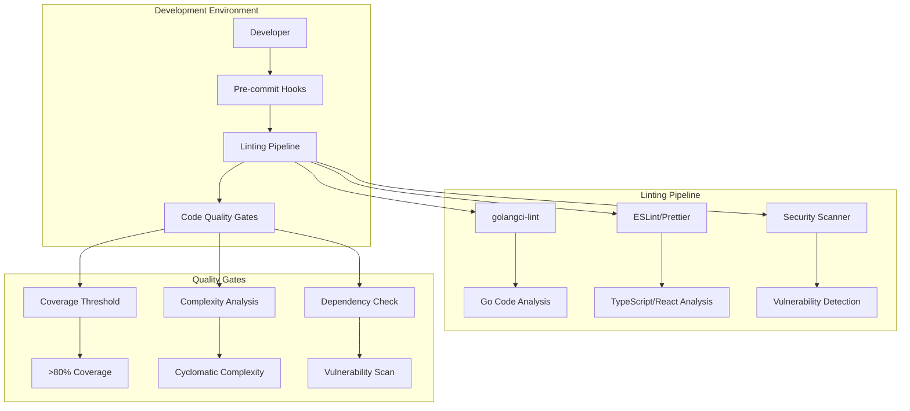

# Auditoría y Mejoras del Proyecto Kthulu - Diseño

## Overview

Este documento presenta el diseño técnico para implementar las mejoras identificadas en la auditoría del proyecto Kthulu. El diseño se enfoca en crear un sistema de calidad enterprise manteniendo la arquitectura modular existente y mejorando la experiencia de desarrollo.

El proyecto Kthulu es un framework modular para aplicaciones web con un backend Go y frontend React, que incluye un CLI avanzado para scaffolding y gestión de extensiones. Las mejoras propuestas abordan gaps críticos en linting, documentación, testing y herramientas de desarrollo.

## Architecture

### Arquitectura de Calidad de Código



### Arquitectura del Sistema de Tagging Mejorado

```mermaid
graph TB
    subgraph "Tag Processing Pipeline"
        A[Source Code] --> B[Tag Parser]
        B --> C[Dependency Analyzer]
        C --> D[Code Generator]
        D --> E[Generated Code]
    end
    
    subgraph "Tag Types"
        F[@kthulu:core] --> G[Core Infrastructure]
        H[@kthulu:module] --> I[Business Modules]
        J[@kthulu:wrap] --> K[Extension Points]
        L[@kthulu:shadow] --> M[Override Points]
        N[@kthulu:observable] --> O[Metrics/Tracing]
    end
    
    subgraph "Generated Artifacts"
        P[Extension Hooks] --> Q[Runtime Integration]
        R[Metrics Code] --> S[Observability]
        T[Contract Tests] --> U[Validation]
    end
    
    B --> F
    B --> H
    B --> J
    B --> L
    B --> N
    D --> P
    D --> R
    D --> T
```

### Arquitectura de CI/CD Mejorada

```mermaid
graph LR
    subgraph "Source Control"
        A[Git Push] --> B[GitHub Actions]
    end
    
    subgraph "Quality Pipeline"
        B --> C[Linting]
        C --> D[Unit Tests]
        D --> E[Integration Tests]
        E --> F[Contract Tests]
        F --> G[E2E Tests]
        G --> H[Security Scan]
    end
    
    subgraph "Deployment Pipeline"
        H --> I[Build Artifacts]
        I --> J[Performance Tests]
        J --> K[Deploy Staging]
        K --> L[Smoke Tests]
        L --> M[Deploy Production]
    end
    
    subgraph "Monitoring"
        M --> N[Health Checks]
        N --> O[Metrics Collection]
        O --> P[Alerting]
    end
```



## Components and Interfaces

### 1. Linting and Code Quality System

#### Backend Linting Configuration
```go
// .golangci.yml configuration
type GolangCIConfig struct {
    Run struct {
        GoVersion string `yaml:"go"`
        Timeout   string `yaml:"timeout"`
        Issues    struct {
            ExcludeRules []ExcludeRule `yaml:"exclude-rules"`
        } `yaml:"issues"`
    } `yaml:"run"`
    
    Linters struct {
        Enable  []string `yaml:"enable"`
        Disable []string `yaml:"disable"`
    } `yaml:"linters"`
    
    LintersSettings struct {
        Govet struct {
            CheckShadowing bool `yaml:"check-shadowing"`
        } `yaml:"govet"`
        Gocyclo struct {
            MinComplexity int `yaml:"min-complexity"`
        } `yaml:"gocyclo"`
    } `yaml:"linters-settings"`
}
```

#### Frontend Linting Enhancement
```typescript
// Enhanced ESLint configuration
interface ESLintConfig {
  extends: string[];
  rules: {
    // Prettier integration
    'prettier/prettier': ['error', {
      semi: true,
      singleQuote: true,
      tabWidth: 2,
      trailingComma: 'es5'
    }];
    
    // TypeScript specific
    '@typescript-eslint/no-unused-vars': 'error';
    '@typescript-eslint/explicit-function-return-type': 'warn';
    
    // React specific
    'react-hooks/exhaustive-deps': 'warn';
    'react/prop-types': 'off';
  };
}
```

### 2. Enhanced Tag Processing System

#### Tag Parser Interface
```go
// Enhanced tag parser for @kthulu:* annotations
type TagParser interface {
    ParseFile(filename string) ([]Tag, error)
    ParseDirectory(dir string) ([]Tag, error)
    FilterByType(tags []Tag, tagType string) []Tag
    ValidateTag(tag Tag) error
}

type Tag struct {
    Type       TagType           `json:"type"`
    Value      string            `json:"value"`
    Attributes map[string]string `json:"attributes"`
    Location   SourceLocation    `json:"location"`
    Metadata   TagMetadata       `json:"metadata"`
}

type TagType string

const (
    TagCore        TagType = "core"
    TagModule      TagType = "module"
    TagWrap        TagType = "wrap"
    TagShadow      TagType = "shadow"
    TagObservable  TagType = "observable"
    TagMetrics     TagType = "metrics"
    TagSecurity    TagType = "security"
    TagDeprecated  TagType = "deprecated"
)

type SourceLocation struct {
    File   string `json:"file"`
    Line   int    `json:"line"`
    Column int    `json:"column"`
}

type TagMetadata struct {
    Dependencies []string  `json:"dependencies"`
    Generated    bool      `json:"generated"`
    Timestamp    time.Time `json:"timestamp"`
}
```

#### Code Generator Interface
```go
type CodeGenerator interface {
    GenerateExtensionHooks(tags []Tag) error
    GenerateObservability(tags []Tag) error
    GenerateContractTests(tags []Tag) error
    GenerateDocumentation(tags []Tag) error
}

type ExtensionHook struct {
    Name         string
    OriginalFunc string
    WrapperFunc  string
    Module       string
    Dependencies []string
}

type ObservabilityCode struct {
    Metrics []MetricDefinition
    Traces  []TraceDefinition
    Logs    []LogDefinition
}
```

### 3. Documentation Synchronization System

#### Documentation Generator
```go
type DocumentationGenerator interface {
    GenerateModuleDoc(module Module) error
    GenerateAPIDoc(handlers []Handler) error
    GenerateArchitectureDoc(modules []Module) error
    ValidateExamples(examples []CodeExample) error
}

type ModuleDocumentation struct {
    Name         string
    Description  string
    Dependencies []string
    APIs         []APIEndpoint
    Examples     []CodeExample
    Tags         []Tag
}

type CodeExample struct {
    Language string
    Code     string
    Expected string
    Runnable bool
}
```

### 4. Enhanced Testing Framework

#### Contract Test Generator
```go
type ContractTestGenerator interface {
    GenerateRepositoryTests(repo Repository) error
    GenerateHandlerTests(handler Handler) error
    GenerateModuleTests(module Module) error
    ValidateContracts(contracts []Contract) error
}

type Contract struct {
    Interface    string
    Methods      []MethodContract
    Dependencies []string
    TestCases    []TestCase
}

type MethodContract struct {
    Name       string
    Parameters []Parameter
    Returns    []Return
    Behavior   []BehaviorAssertion
}
```

### 5. Performance Monitoring System

#### Metrics Collection
```go
type MetricsCollector interface {
    CollectHTTPMetrics(handler http.Handler) http.Handler
    CollectDatabaseMetrics(db *gorm.DB) *gorm.DB
    CollectBusinessMetrics(module Module) error
    ExportMetrics() ([]byte, error)
}

type MetricDefinition struct {
    Name        string
    Type        MetricType
    Description string
    Labels      []string
    Module      string
}

type MetricType string

const (
    Counter   MetricType = "counter"
    Histogram MetricType = "histogram"
    Gauge     MetricType = "gauge"
    Summary   MetricType = "summary"
)
```

## Data Models

### Configuration Models

#### Project Configuration
```go
type ProjectConfig struct {
    Name        string            `yaml:"name"`
    Version     string            `yaml:"version"`
    GoVersion   string            `yaml:"go_version"`
    Modules     []string          `yaml:"modules"`
    Features    map[string]bool   `yaml:"features"`
    Quality     QualityConfig     `yaml:"quality"`
    Observability ObservabilityConfig `yaml:"observability"`
}

type QualityConfig struct {
    CoverageThreshold float64 `yaml:"coverage_threshold"`
    LintingEnabled    bool    `yaml:"linting_enabled"`
    SecurityScan      bool    `yaml:"security_scan"`
    PerformanceTests  bool    `yaml:"performance_tests"`
}

type ObservabilityConfig struct {
    MetricsEnabled bool   `yaml:"metrics_enabled"`
    TracingEnabled bool   `yaml:"tracing_enabled"`
    LogLevel       string `yaml:"log_level"`
}
```

#### Module Registry Enhancement
```go
type EnhancedModule struct {
    Module
    Tags         []Tag             `json:"tags"`
    Dependencies []string          `json:"dependencies"`
    Contracts    []Contract        `json:"contracts"`
    Metrics      []MetricDefinition `json:"metrics"`
    Status       ModuleStatus      `json:"status"`
}

type ModuleStatus string

const (
    StatusStable      ModuleStatus = "stable"
    StatusBeta        ModuleStatus = "beta"
    StatusExperimental ModuleStatus = "experimental"
    StatusDeprecated  ModuleStatus = "deprecated"
)
```

### Quality Metrics Models

#### Code Quality Metrics
```go
type QualityMetrics struct {
    Coverage          float64           `json:"coverage"`
    CyclomaticComplexity int           `json:"cyclomatic_complexity"`
    LinesOfCode       int              `json:"lines_of_code"`
    TechnicalDebt     time.Duration    `json:"technical_debt"`
    Vulnerabilities   []Vulnerability  `json:"vulnerabilities"`
    LintingIssues     []LintingIssue   `json:"linting_issues"`
}

type Vulnerability struct {
    ID          string `json:"id"`
    Severity    string `json:"severity"`
    Description string `json:"description"`
    File        string `json:"file"`
    Line        int    `json:"line"`
}

type LintingIssue struct {
    Rule        string `json:"rule"`
    Severity    string `json:"severity"`
    Message     string `json:"message"`
    File        string `json:"file"`
    Line        int    `json:"line"`
    Fixable     bool   `json:"fixable"`
}
```

## Error Handling

### Comprehensive Error Management

#### Error Types
```go
type KthuluError struct {
    Code      ErrorCode `json:"code"`
    Message   string    `json:"message"`
    Details   string    `json:"details"`
    Context   map[string]interface{} `json:"context"`
    Timestamp time.Time `json:"timestamp"`
    Stack     string    `json:"stack,omitempty"`
}

type ErrorCode string

const (
    ErrLintingFailed     ErrorCode = "LINTING_FAILED"
    ErrTestsFailed       ErrorCode = "TESTS_FAILED"
    ErrTagParsingFailed  ErrorCode = "TAG_PARSING_FAILED"
    ErrCodeGenFailed     ErrorCode = "CODE_GENERATION_FAILED"
    ErrDocGenFailed      ErrorCode = "DOCUMENTATION_GENERATION_FAILED"
    ErrSecurityViolation ErrorCode = "SECURITY_VIOLATION"
    ErrPerformanceIssue  ErrorCode = "PERFORMANCE_ISSUE"
)
```

#### Error Recovery Strategies
```go
type ErrorRecoveryStrategy interface {
    CanRecover(err error) bool
    Recover(err error) error
    GetFallback() interface{}
}

type LintingErrorRecovery struct{}

func (r *LintingErrorRecovery) CanRecover(err error) bool {
    kthuluErr, ok := err.(*KthuluError)
    return ok && kthuluErr.Code == ErrLintingFailed
}

func (r *LintingErrorRecovery) Recover(err error) error {
    // Attempt auto-fix for common linting issues
    return autoFixLintingIssues(err)
}
```

## Testing Strategy

### Multi-Layer Testing Approach

#### 1. Unit Testing Enhancement
```go
type TestSuite struct {
    Name        string
    Tests       []TestCase
    Setup       func() error
    Teardown    func() error
    Coverage    float64
    Performance PerformanceMetrics
}

type TestCase struct {
    Name        string
    Function    func(*testing.T)
    Tags        []string
    Timeout     time.Duration
    Parallel    bool
    Benchmark   bool
}
```

#### 2. Contract Testing Framework
```go
type ContractTestSuite struct {
    Interface   string
    Contracts   []Contract
    Mocks       []MockDefinition
    Scenarios   []TestScenario
}

type TestScenario struct {
    Name        string
    Given       []Precondition
    When        Action
    Then        []Assertion
}
```

#### 3. Integration Testing
```go
type IntegrationTestConfig struct {
    Database    DatabaseConfig
    Services    []ServiceConfig
    Fixtures    []Fixture
    Cleanup     bool
}

type ServiceConfig struct {
    Name    string
    Port    int
    Health  string
    Timeout time.Duration
}
```

#### 4. E2E Testing Enhancement
```typescript
interface E2ETestConfig {
  browsers: BrowserConfig[];
  environments: EnvironmentConfig[];
  parallelism: number;
  retries: number;
  timeout: number;
  screenshots: boolean;
  videos: boolean;
}

interface BrowserConfig {
  name: 'chromium' | 'firefox' | 'webkit';
  headless: boolean;
  viewport: { width: number; height: number };
  devices?: string[];
}
```

### Performance Testing Strategy

#### Load Testing Configuration
```go
type LoadTestConfig struct {
    Scenarios []LoadScenario
    Duration  time.Duration
    RampUp    time.Duration
    Users     int
    Metrics   []string
}

type LoadScenario struct {
    Name      string
    Weight    float64
    Requests  []HTTPRequest
    ThinkTime time.Duration
}
```

## Implementation Phases

### Phase 1: Foundation (Week 1-2)
1. **Linting Configuration**
   - Setup golangci-lint with Go 1.23 compatibility
   - Fix ESLint/Prettier issues in frontend
   - Configure pre-commit hooks
   - Integrate linting in CI/CD

2. **Version Compatibility**
   - Update go.mod to use Go 1.23.x
   - Update all tool versions
   - Resolve dependency conflicts
   - Test build compatibility

### Phase 2: Documentation Sync (Week 2-3)
1. **Content Updates**
   - Update README.md with accurate project description
   - Sync module documentation with code
   - Update CLI usage examples
   - Create architecture diagrams

2. **Automated Documentation**
   - Implement doc generation from code
   - Setup doc validation in CI
   - Create interactive examples
   - Generate API documentation

### Phase 3: Enhanced Tagging System (Week 3-5)
1. **Tag Parser Implementation**
   - Build comprehensive tag parser
   - Support all defined tag types
   - Implement validation logic
   - Create tag database

2. **Code Generation**
   - Implement extension hook generation
   - Build observability code generator
   - Create contract test generator
   - Integrate with CLI compile command

### Phase 4: Testing and Quality (Week 5-6)
1. **Test Framework Enhancement**
   - Improve contract testing
   - Enhance integration tests
   - Fix E2E test issues
   - Implement performance testing

2. **Quality Gates**
   - Setup coverage thresholds
   - Implement security scanning
   - Create quality dashboards
   - Configure automated reporting

### Phase 5: Observability and Monitoring (Week 6-7)
1. **Metrics Implementation**
   - Auto-generate Prometheus metrics
   - Implement distributed tracing
   - Setup structured logging
   - Create Grafana dashboards

2. **Performance Optimization**
   - Implement profiling
   - Setup benchmarking
   - Create performance alerts
   - Optimize critical paths

### Phase 6: CI/CD and Deployment (Week 7-8)
1. **Pipeline Enhancement**
   - Improve GitHub Actions workflows
   - Add security scanning
   - Implement deployment automation
   - Setup monitoring integration

2. **Production Readiness**
   - Configure health checks
   - Setup alerting
   - Implement rollback procedures
   - Create runbooks

## Security Considerations

### Security Framework
```go
type SecurityConfig struct {
    Authentication AuthConfig    `yaml:"authentication"`
    Authorization  AuthzConfig   `yaml:"authorization"`
    Encryption     CryptoConfig  `yaml:"encryption"`
    Auditing       AuditConfig   `yaml:"auditing"`
}

type AuthConfig struct {
    Provider     string        `yaml:"provider"`
    TokenExpiry  time.Duration `yaml:"token_expiry"`
    RefreshExpiry time.Duration `yaml:"refresh_expiry"`
    SecretRotation bool         `yaml:"secret_rotation"`
}
```

### Vulnerability Management
- Automated dependency scanning
- Security-focused linting rules
- Regular security audits
- Penetration testing integration

## Performance Considerations

### Optimization Strategies
1. **Code Generation Optimization**
   - Lazy loading of generated code
   - Caching of parsed tags
   - Incremental compilation
   - Parallel processing

2. **Runtime Performance**
   - Connection pooling
   - Query optimization
   - Caching strategies
   - Resource management

3. **Build Performance**
   - Incremental builds
   - Parallel testing
   - Artifact caching
   - Optimized Docker images

## Monitoring and Alerting

### Metrics Collection
```go
type MetricsConfig struct {
    Prometheus PrometheusConfig `yaml:"prometheus"`
    Grafana    GrafanaConfig    `yaml:"grafana"`
    Alerting   AlertingConfig   `yaml:"alerting"`
}

type AlertingConfig struct {
    Rules     []AlertRule `yaml:"rules"`
    Channels  []Channel   `yaml:"channels"`
    Escalation EscalationPolicy `yaml:"escalation"`
}
```

### Health Checks
- Application health endpoints
- Database connectivity checks
- External service dependencies
- Resource utilization monitoring

This design provides a comprehensive foundation for implementing all the requirements while maintaining the existing architecture and ensuring scalability and maintainability.