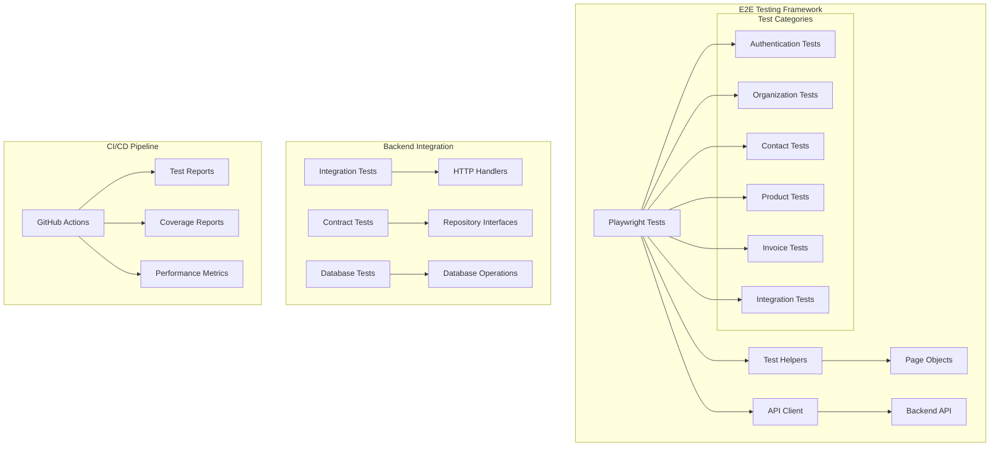

# Kthulu E2E Testing Implementation

## Overview

This document describes the comprehensive end-to-end (E2E) testing framework implemented for the Kthulu application. The framework provides full-stack testing capabilities covering frontend interactions, backend API integration, and complete business workflows.

## Architecture



## Components

### 1. Frontend E2E Tests (Playwright)

**Location**: `e2e/`

**Features**:
- Cross-browser testing (Chrome, Firefox, Safari, Mobile)
- Visual regression testing with screenshots
- Test data management and cleanup
- Parallel test execution
- Comprehensive reporting

**Test Categories**:
- **Authentication** (`auth.spec.ts`) - Login, registration, password reset
- **Organizations** (`organizations.spec.ts`) - CRUD operations, permissions
- **Contacts** (`contacts.spec.ts`) - Customer/supplier management
- **Products** (`products.spec.ts`) - Product catalog management
- **Invoices** (`invoices.spec.ts`) - Invoice creation and management
- **Integration** (`integration.spec.ts`) - Full business workflows

### 2. Backend Integration Tests

**Location**: `backend/internal/integration/`

**Features**:
- Full HTTP API testing
- Database integration testing
- Transaction and concurrency testing
- Performance benchmarking

**Test Categories**:
- **API Tests** (`api_test.go`) - HTTP endpoint testing
- **Database Tests** (`database_test.go`) - Database operation testing

### 3. Contract Tests

**Location**: `backend/internal/contracts/`

**Features**:
- Repository interface compliance
- HTTP endpoint contract validation
- API specification adherence
- Type safety verification

### 4. Test Utilities

**API Client** (`e2e/utils/api-client.ts`):
- Comprehensive backend API integration
- Authentication management
- Request/response handling
- Error handling and retries

**Test Helpers** (`e2e/utils/test-helpers.ts`):
- Common test operations
- Page navigation helpers
- Form interaction utilities
- Assertion helpers
- Data setup and cleanup

### 5. CI/CD Integration

**GitHub Actions** (`.github/workflows/e2e-tests.yml`):
- Automated test execution on PR/push
- Multi-environment testing
- Performance monitoring
- Security scanning
- Comprehensive reporting

## Test Execution

### Local Development

```bash
# Setup E2E environment
make setup-e2e

# Run all E2E tests
make test-e2e

# Run specific test categories
make test-integration    # Backend integration tests
make test-contracts     # Contract tests
make test-all          # All test types

# Run with options
./scripts/test-e2e.sh --no-backend     # Skip backend tests
./scripts/test-e2e.sh --no-frontend    # Skip frontend tests
./scripts/test-e2e.sh --no-build       # Skip build step
```

### CI/CD Pipeline

The GitHub Actions workflow automatically:

1. **Sets up the environment** with Node.js, Go, and dependencies
2. **Builds the application** (frontend and backend)
3. **Runs backend integration tests** with PostgreSQL
4. **Starts the backend server** for E2E testing
5. **Executes Playwright tests** across multiple browsers
6. **Generates comprehensive reports** with screenshots and videos
7. **Uploads artifacts** for debugging and analysis
8. **Comments on PRs** with test results summary

### Test Data Management

**Global Setup**:
- Server health checks and readiness verification
- Database reset and initial data seeding
- Test user creation with different roles
- Organization and sample data setup

**Test Isolation**:
- Each test runs with fresh, isolated data
- Unique identifiers prevent test conflicts
- Automatic cleanup after test completion
- Concurrent test execution support

**Data Factories**:
```typescript
// Create test data programmatically
const orgId = await helpers.createTestOrganization('Test Org');
const contactId = await helpers.createTestContact(orgId, 'Test Contact');
const productId = await helpers.createTestProduct(orgId, 'Test Product');
const invoiceId = await helpers.createTestInvoice(orgId, 'Test Customer');
```

## Test Coverage

### Frontend Coverage

- **Authentication Flow**: Registration, login, logout, password reset
- **User Management**: Profile management, role-based access
- **Organization Management**: CRUD operations, multi-tenant isolation
- **Contact Management**: Customer/supplier/lead/partner management
- **Product Management**: Catalog management, variants, pricing
- **Invoice Management**: Creation, payment tracking, PDF generation
- **Navigation**: All major application routes and workflows
- **Error Handling**: Network errors, validation errors, edge cases
- **Performance**: Page load times, interaction responsiveness

### Backend Coverage

- **HTTP API**: All endpoints with various scenarios
- **Authentication**: JWT token management, refresh tokens
- **Authorization**: Role-based access control, organization isolation
- **Database Operations**: CRUD operations, transactions, concurrency
- **Business Logic**: Use case implementations, domain rules
- **Error Handling**: Validation errors, database errors, edge cases
- **Performance**: Response times, concurrent requests

### Integration Coverage

- **End-to-End Workflows**: Complete business processes
- **Multi-User Scenarios**: Concurrent sessions, data isolation
- **Cross-Module Integration**: Data consistency across modules
- **Error Recovery**: Offline scenarios, network failures
- **Performance Under Load**: Large datasets, concurrent operations

## Reporting and Monitoring

### Test Reports

**Playwright HTML Report**:
- Interactive test results with filtering
- Screenshots and videos for failed tests
- Trace viewer for detailed debugging
- Performance metrics and timing

**Coverage Reports**:
- Backend code coverage with HTML visualization
- Contract test coverage metrics
- Integration test coverage analysis

**Performance Metrics**:
- Page load times and responsiveness
- API response times and throughput
- Database query performance
- Memory usage and resource consumption

### CI/CD Integration

**Automated Reporting**:
- PR comments with test result summaries
- Artifact uploads for detailed analysis
- Performance regression detection
- Security vulnerability scanning

**Notifications**:
- Slack/email notifications for test failures
- Performance degradation alerts
- Security issue notifications

## Best Practices

### Test Design

1. **Test Independence**: Each test runs in isolation with fresh data
2. **Realistic Scenarios**: Tests mirror real user workflows
3. **Comprehensive Coverage**: All major features and edge cases
4. **Performance Awareness**: Tests include performance monitoring
5. **Error Handling**: Tests verify error scenarios and recovery

### Maintenance

1. **Regular Updates**: Keep tests updated with feature changes
2. **Flaky Test Management**: Identify and fix unreliable tests
3. **Performance Monitoring**: Track test execution times
4. **Documentation**: Maintain clear test documentation
5. **Code Review**: Review test code like production code

### Debugging

1. **Headed Mode**: Run tests with visible browser for debugging
2. **Debug Mode**: Step through tests with breakpoints
3. **Trace Viewer**: Analyze test execution with detailed traces
4. **Screenshots**: Capture visual state at key points
5. **Logging**: Comprehensive logging for troubleshooting

## Performance Benchmarks

### Target Metrics

- **Page Load Time**: < 2 seconds for initial load
- **API Response Time**: < 500ms for CRUD operations
- **Test Execution Time**: < 30 minutes for full suite
- **Test Reliability**: > 99% pass rate in CI/CD

### Monitoring

- **Continuous Performance Tracking**: Monitor trends over time
- **Regression Detection**: Alert on performance degradation
- **Resource Usage**: Track memory and CPU consumption
- **Scalability Testing**: Test with large datasets

## Security Testing

### Automated Security Scans

- **Gosec**: Go security scanner for backend code
- **npm audit**: Node.js dependency vulnerability scanning
- **SARIF Integration**: Security findings in GitHub Security tab

### Security Test Scenarios

- **Authentication Security**: Token validation, session management
- **Authorization Testing**: Access control verification
- **Input Validation**: SQL injection, XSS prevention
- **Data Protection**: Sensitive data handling

## Future Enhancements

### Planned Improvements

1. **Visual Regression Testing**: Automated UI change detection
2. **Mobile Testing**: Comprehensive mobile device coverage
3. **Accessibility Testing**: WCAG compliance verification
4. **Load Testing**: High-volume concurrent user simulation
5. **API Contract Testing**: OpenAPI specification validation

### Scalability

1. **Parallel Execution**: Increase test parallelization
2. **Cloud Testing**: Utilize cloud testing platforms
3. **Test Sharding**: Distribute tests across multiple runners
4. **Caching**: Optimize test setup and teardown

## Troubleshooting

### Common Issues

1. **Server Startup Failures**: Check port availability and dependencies
2. **Test Timeouts**: Increase timeouts for slow operations
3. **Flaky Tests**: Add proper waits and retry mechanisms
4. **Data Conflicts**: Ensure unique test data identifiers

### Debug Resources

1. **Test Logs**: Comprehensive logging for all operations
2. **Screenshots**: Visual debugging for UI issues
3. **Network Logs**: API request/response debugging
4. **Database State**: Verify test data setup and cleanup

## Conclusion

The Kthulu E2E testing framework provides comprehensive coverage of the entire application stack, ensuring reliability, performance, and security. The framework is designed to be maintainable, scalable, and integrated into the development workflow, providing confidence in application quality and enabling rapid, safe development iterations.